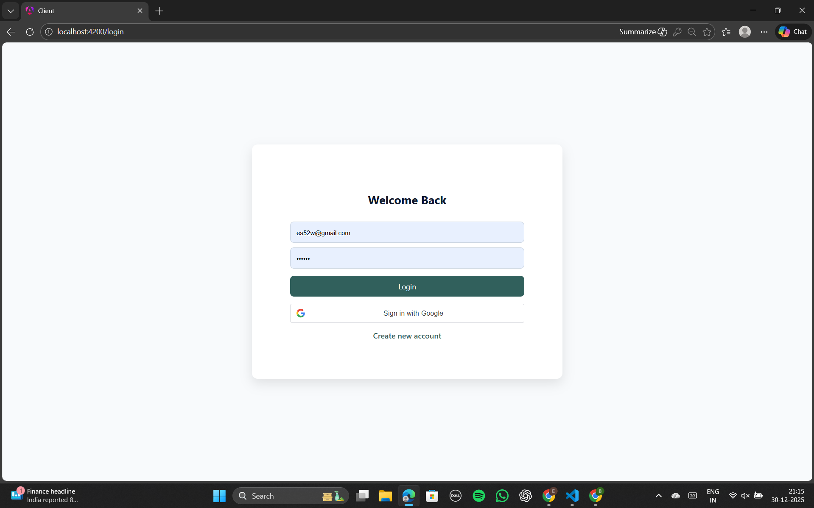
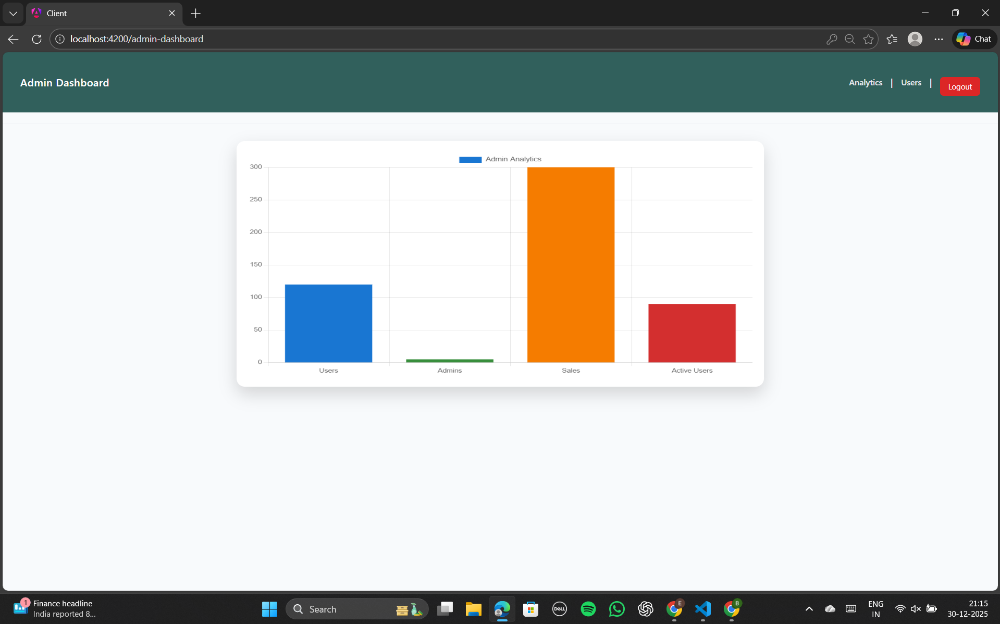
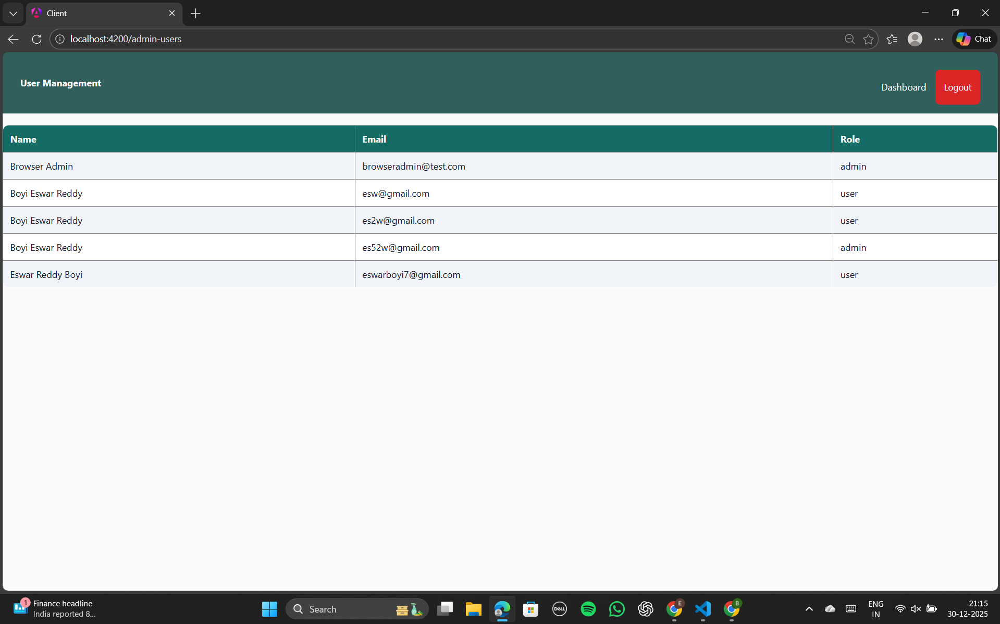
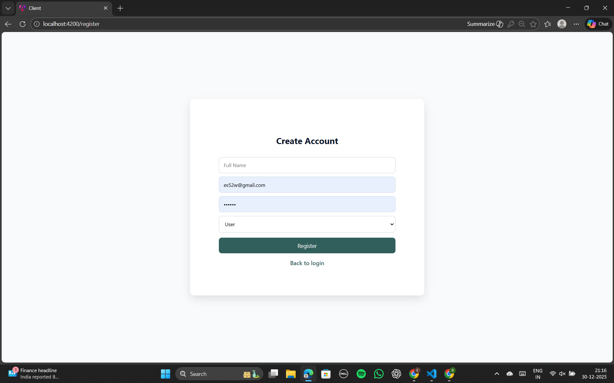
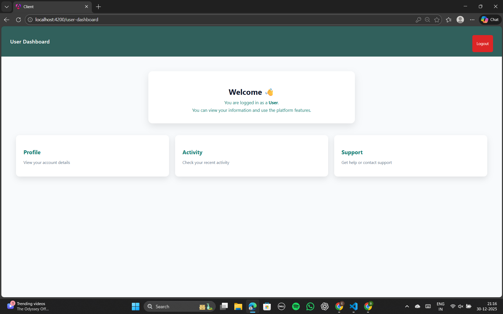

# Admin Dashboard with Analytics & Reporting (MEAN Stack)

## Project Description
This project is a role-based Admin Dashboard built using the MEAN stack
(MongoDB, Express.js, Angular, Node.js). It provides secure authentication,
Google SSO, admin analytics, user management, and responsive UI similar to
real-world CRM and analytics platforms.

---

## Features
- User Authentication (Login & Register)
- Role-based Authorization (Admin / User)
- Google SSO Integration
- Admin Dashboard with Analytics (Chart.js)
- Admin Controls to Manage Users
- User Dashboard
- Responsive UI
- Secure JWT-based APIs

---

## Tech Stack & Versions
- Node.js: v18+
- npm: v9+
- Angular: v19
- MongoDB: Atlas Cloud Database
- Express.js: v5
- Chart.js: v4
- Google Identity Services (SSO)

---

## Project Setup (Local)

### 1. Clone or Extract Project
```bash
git clone https://github.com/EswarReddyBoyi/admin-dashboard
cd dashboard
```
---

### 2. Backend Setup
```bash
cd server
npm install
```

### Create a .env file in server/:
```bash
PORT=5000
MONGO_URI=<Your MongoDB Atlas URI>
JWT_SECRET=your_jwt_secret_key
GOOGLE_CLIENT_ID=<Your Google Client ID>
```

### Run backend:
```bash
npm run dev
```

### Backend runs at:
```bash
http://localhost:5000
```

---

### 3. Frontend Setup
```bash
cd client
npm install
npm start
```

### Frontend runs at:
```bash
http://localhost:4200
```

---

### Application Flow

Login/Register using email & password or Google SSO

Admin users are redirected to Admin Dashboard

Normal users are redirected to User Dashboard

Admin can view analytics and manage users

All routes are protected using JWT and role-based guards

---

### Screenshots

<table>
  <tr>
    <th> Login Page Page</th>
    <th> Admin Dashboard (Analytics) Page</th>
    <th> Admin Users Page</th>
  </tr>
  <tr>
    <td> </td>
    <td> </td>
    <td> </td>
  </tr>
</table>

<table>
  <tr>
    <th> Register Page</th>
    <th> User Dashboard Page</th>
  </tr>
  <tr>
    <td> </td>
    <td> </td>
  </tr>
</table>


---

### Contact
***email:*** eswarboyi7@gmail.com

---

### Real-world Relevance

This project simulates real-world admin panels used in CRM systems and
analytics platforms with secure authentication, role management, and
dashboard visualization.
